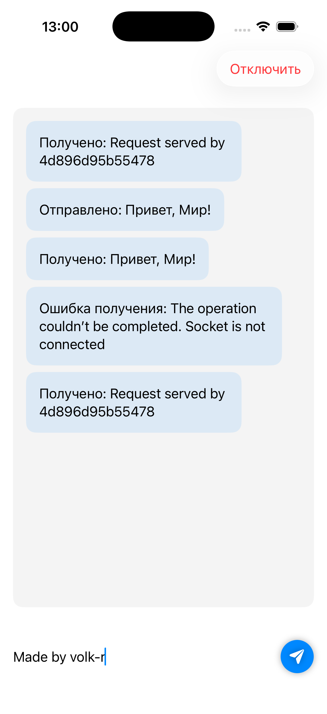

# WebSocket Chat

Небольшое iOS-приложение на SwiftUI для демонстрации работы с WebSocket через `URLSessionWebSocketTask`. Подключается к публичному echo-серверу, отправляет текстовые сообщения и отображает ответы в простом чате.

## Скриншоты

Экран чата с историей сообщений, полем ввода и кнопкой отправки:



## Возможности

- Автоматическое подключение к WebSocket при открытии экрана
- Отправка и приём текстовых сообщений
- История чата с пузырями «Отправлено: …» и «Получено: …»
- Кнопка «Подключить» / «Отключить» в toolbar
- Оптимистичное отображение отправленных сообщений до ответа сервера

## Требования

- Xcode с поддержкой iOS 26.5+
- Swift 5.0+
- Доступ в интернет (для `wss://echo.websocket.org`)

## Запуск

1. Откройте `WebSocket.xcodeproj` в Xcode.
2. Выберите симулятор или устройство.
3. Нажмите **Run** (⌘R).

При старте приложение автоматически подключается к echo-серверу. Введите текст в поле внизу экрана и нажмите кнопку с иконкой самолётика — сервер вернёт то же сообщение обратно.

## Структура проекта

```
WebSocket/
├── WebSocketApp.swift    # Точка входа приложения
├── ContentView.swift     # UI чата, WebSocketManager, модель ChatMessage
└── Assets.xcassets       # Иконка и цвета
```

### Основные компоненты

| Компонент | Назначение |
|-----------|------------|
| `ChatMessage` | Модель сообщения с уникальным `UUID` для корректного `ForEach` |
| `WebSocketManager` | Управление соединением, отправка и приём через `URLSession` |
| `ContentView` | Экран чата: список сообщений, поле ввода, toolbar |

## Как это работает

```
┌─────────────┐     wss://echo.websocket.org     ┌──────────────┐
│  ContentView │ ◄────────────────────────────► │ Echo-сервер  │
└──────┬──────┘                                   └──────────────┘
       │
       ▼
┌──────────────────┐
│ WebSocketManager │
│  connect()       │──► URLSessionWebSocketTask.resume()
│  sendMessage()   │──► webSocketTask.send(.string)
│  receiveMessages │──► рекурсивный receive { ... }
└──────────────────┘
```

1. **`connect()`** — создаёт `URLSessionWebSocketTask`, вызывает `resume()` и запускает цикл приёма.
2. **`sendMessage(_:)`** — отправляет строку на сервер; в UI сообщение добавляется отдельно в `ContentView`.
3. **`receiveMessages()`** — после каждого успешного кадра снова регистрирует `receive`, пока соединение открыто.
4. **`disconnect()`** — закрывает сокет с кодом `.normalClosure`.

Все обновления UI выполняются на `@MainActor` через Swift Observation (`@Observable`).

## Echo-сервер

По умолчанию используется [echo.websocket.org](https://echo.websocket.org):

```swift
private let url = URL(string: "wss://echo.websocket.org")!
```

Сервер возвращает отправленный текст без изменений. При подключении может прийти служебное сообщение вида `Request served by …`.

Чтобы подключиться к другому серверу, измените URL в `WebSocketManager`.

## Лицензия

Учебный проект. Используйте свободно.
